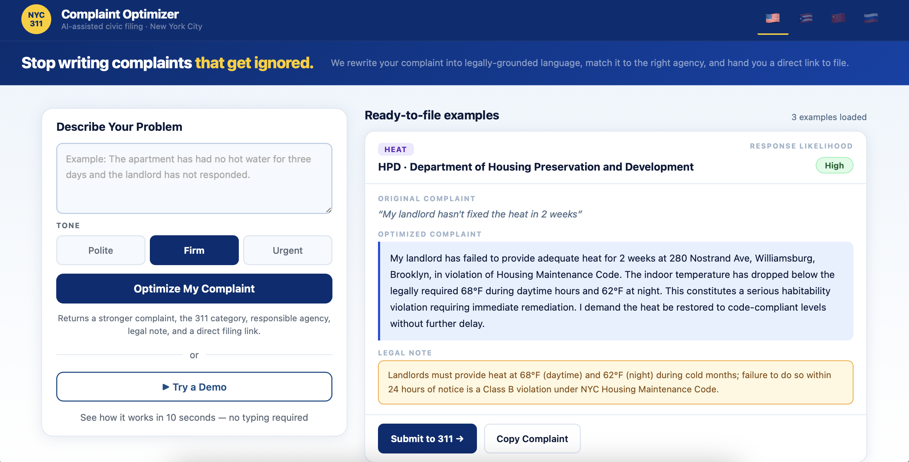

# NYC 311 Complaint Optimizer

Turn plain English frustrations into strong, legally grounded NYC 311 complaints — routed to the right agency with a direct filing link.

**Live app:** https://nyc-311-optimizer.vercel.app  
**Repo:** https://github.com/rezataeb/NYC-311-optimizer

---



---

## What It Does

1. Describe your problem in plain English
2. Pick a tone: **Polite**, **Firm**, or **Urgent**
3. Claude rewrites it into a specific, legally grounded complaint and returns:
   - Optimized complaint text (always output in English for 311 submission)
   - 311 category (e.g. `HEAT/HOT WATER`, `NOISE`, `SANITATION`)
   - Responsible agency acronym + full name (e.g. HPD, DOT, DSNY)
   - Legal note — what the city is required to do and by when
   - Response likelihood badge: **High**, **Medium**, or **Low**
   - Direct link to the correct 311 filing page
4. Copy the complaint with one click or go straight to 311

---

## Features

- **Tone selector** — Polite / Firm / Urgent
- **AI rewrite** — category, agency, legal note, and optimized complaint via Claude Haiku
- **Response likelihood badge** — High / Medium / Low, color-coded
- **Direct 311 submit links** — hardcoded lookup table, never AI-generated
- **Copy to clipboard** — always copies the English version (what 311 receives)
- **Smart address detection** — handles full address, borough-only, or no location needed
- **Borough mismatch detection** — deterministic check, not AI-judged
- **Multilingual UI** — use the app in English 🇺🇸, Spanish 🇵🇷, Mandarin 🇨🇳, or Russian 🇷🇺 via the flag switcher in the header; complaint output is always in English
- **Demo Mode** — one-click walkthrough for presentations (▶ Try a Demo button)
- **3 pre-loaded examples** — heat, noise, pothole; static data, no API calls on page load

---

## Tech Stack

| Layer | Tech |
|---|---|
| Frontend | Vanilla JS, single `index.html`, no framework |
| Build / Dev | Vite |
| AI | Claude Haiku (`claude-haiku-4-5-20251001`) |
| API proxy | Vercel serverless function (`api/optimize.js`) |
| Hosting | Vercel — auto-deploys on push to `main` |
| Auth / DB | None |

---

## Run Locally

```bash
git clone https://github.com/rezataeb/NYC-311-optimizer
cd NYC-311-optimizer/app
npm install
```

Create a `.env` file at the project root:

```
ANTHROPIC_API_KEY=sk-ant-...
```

```bash
npm run dev
```

Open `http://localhost:5173`.

---

## Project Structure

```
.
├── api/
│   └── optimize.js     # Vercel serverless function — proxies Anthropic API
├── index.html          # entire frontend — HTML, CSS, vanilla JS
├── translations.js     # UI strings for EN / ES / ZH / RU
├── vite.config.js
└── .env                # ANTHROPIC_API_KEY (never committed)
```

---

## Why This Exists

Built as a civic tech portfolio project for an NYC gov/tech job search. The API key lives in Vercel's server environment and is never exposed in the browser bundle.
